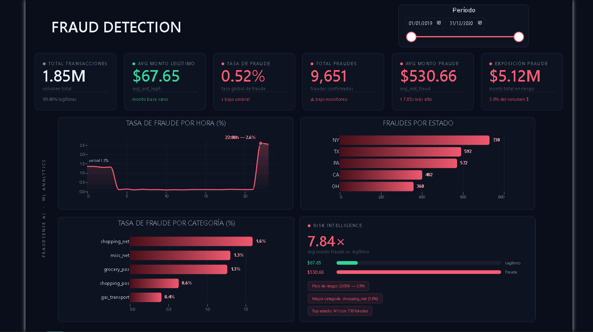

# FraudSense AI — Fraud Risk Analytics

> End-to-end fraud detection project: SQL pattern analysis, Python EDA, ML baseline, Power BI dashboard, and an AI-powered explanation API built with FastAPI + Claude.


---

## What this project does

1. **Loads 1.85M credit card transactions** into PostgreSQL and queries fraud patterns with SQL
2. **Explores the data** with Python (pandas, seaborn) to find statistical signals
3. **Trains ML models** (Logistic Regression + Random Forest) to classify fraud
4. **Visualizes findings** in an interactive Power BI dashboard
5. **Explains any transaction** in plain language via a FastAPI + Claude API
6. **Demos everything** through a Gradio web interface

---

## Dashboard

Interactive Power BI dashboard with a dark theme: KPI cards, fraud rate by hour and category, fraud by state, and a "Risk Intelligence" panel.



---

## ML Results

| Model | Precision (Fraud) | Recall (Fraud) | F1 (Fraud) | AUC-ROC |
|---|---|---|---|---|
| Logistic Regression | 0.07 | 0.77 | 0.13 | 0.8655 |
| **Random Forest** | **0.97** | **0.81** | **0.88** | **0.9870** |

**Feature importance (Random Forest):**

| Feature | Importance |
|---|---|
| amt (transaction amount) | 47.6% |
| amt_zscore_card (amount vs card history) | 19.9% |
| hour (time of day) | 16.1% |
| category_enc | 10.2% |
| age, city_pop, distance_km, ... | 6.3% |

---

## Key Findings

- **`shopping_net` has the highest fraud rate: 1.59%** — online categories consistently outperform physical ones
- **Fraud peaks between 0am–3am** with rates ~10x the daily average
- **Average fraud amount ($530) is 8x the legitimate average ($67)** — amount is the single strongest signal
- **`amt_zscore_card` max: 63.42** — one transaction was 63 standard deviations above the cardholder's typical spending
- Dataset is clean: 0 nulls across all columns

---

## Project Structure

```
fraud-risk-analytics/
├── sql/
│   ├── 01_schema.sql          # transactions table definition
│   ├── 02_load.sql            # CSV load into PostgreSQL
│   └── 03_patterns.sql        # 4 fraud pattern queries + suspicious_transactions view
├── notebooks/
│   ├── 01_eda.ipynb           # Exploratory Data Analysis
│   └── 02_modeling.ipynb      # ML baseline (LR + Random Forest)
├── api/
│   ├── main.py                # FastAPI app — /explain and /ask endpoints
│   ├── schemas.py             # Pydantic models
│   └── claude_client.py       # Claude API integration + risk scoring
├── outputs/                   # Saved charts from notebooks
├── powerbi/
│   └── fraud_dashboard.pbix   # Power BI dashboard
└── app.py                     # Gradio interface
```

---

## Stack

| Layer | Technology |
|---|---|
| Database | PostgreSQL 17 |
| Data analysis | Python 3.13, pandas, numpy, seaborn |
| ML | scikit-learn (LogisticRegression, RandomForestClassifier) |
| API | FastAPI + Pydantic + uvicorn |
| AI explanations | Anthropic Claude API (claude-haiku-4-5) |
| Web interface | Gradio |
| Dashboard | Power BI Desktop |
| Package manager | uv |

---

## Quick Start

### 1. Clone and install dependencies

```bash
git clone https://github.com/pabloler21/fraud-risk-analytics
cd fraud-risk-analytics
uv sync
```

### 2. Configure environment

```bash
cp .env.example .env
# Add your Anthropic API key to .env
```

### 3. Set up the database

Requires PostgreSQL running locally. Create the database and load data:

```bash
psql -U postgres -c "CREATE DATABASE fraud_db;"
psql -U postgres -d fraud_db -f sql/01_schema.sql
# Download dataset from Kaggle (kartik2112/fraud-detection) into data/raw/
psql -U postgres -d fraud_db -f sql/02_load.sql
```

### 4. Run the API

```bash
uvicorn api.main:app --reload
# API available at http://localhost:8000
# Swagger docs at http://localhost:8000/docs
```

### 5. Run the Gradio interface

```bash
python app.py
# UI available at http://localhost:7860
```

---

## API Endpoints

### `POST /explain`

Receives transaction data and returns a natural language explanation of the fraud risk.

```json
{
  "amt": 523.45,
  "category": "shopping_net",
  "hour": 2,
  "age": 34,
  "distance_km": 187.3,
  "amt_zscore_card": 4.8
}
```

Response includes `risk_level` (`ALTO` / `MEDIO` / `BAJO`) and a detailed explanation from Claude.

### `POST /ask`

Ask any question about the dataset, model, or fraud patterns.

```json
{ "question": "Why does fraud peak between 0am and 3am?" }
```

---

## Dataset

[Credit Card Transactions Fraud Detection (Sparkov)](https://www.kaggle.com/datasets/kartik2112/fraud-detection) — Kaggle

- 1,852,394 total transactions
- 9,651 confirmed frauds (0.52% fraud rate)
- Date range: January 2019 – December 2020
- Synthetic dataset generated with the Sparkov Data Generation tool

---

## Author

**Pablo** — Data Analyst | AI Engineering  
[GitHub](https://github.com/pabloler21)
